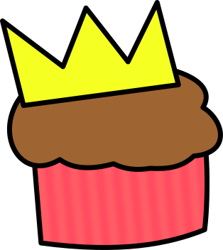

#  

I'm Brianna Rainey, also known as `tassaron`. I love open source software so I create a lot of it on GitHub. I hope you find it useful!

* I have an [online arcade 🕹️](https://rainey.tech) where you can submit your score for tokens 🪙

* Learn about how I started coding in [my bio 📖](https://rainey.tech/bio)

* [I also post gists!🔗](https://gist.github.com/tassaron)

* [Here's a video I recorded](https://www.youtube.com/watch?v=EVt2ckQs1Yg) 🎥 of an app I worked on, [Audio Visualizer](https://github.com/djfun/audio-visualizer-python)

* My tmux has a cat in the statusbar [=^.^=](https://github.com/tassaron/nagcat)